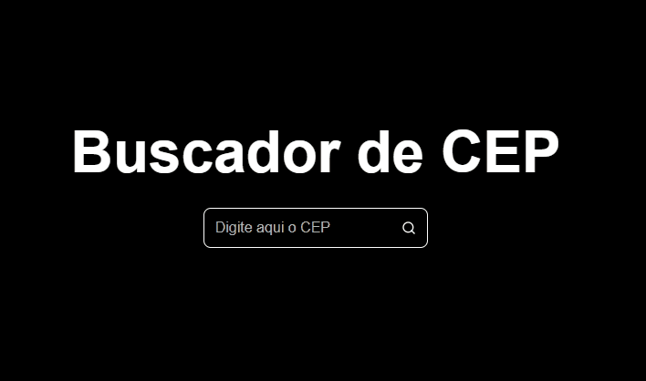

# BuscaCep

### O objetivo dessa aplicação feita em React é realizar consultas de CEP do Brasil e retornar os dados do endereço correspondente, caso seja válido. 

# Realizando uma consulta



# Tecnologias

<ul>
<li><a href="https://pt-br.reactjs.org/">ReactJS</a></li>
<li><a href="https://styled-components.com/">Styled Components</a></li>
<li><a href="https://axios-http.com/docs/intro">Axios</a></li>
</ul>

# Como executar

```bash
1º - Clone o projeto com o comando "git clone https://github.com/jeanpereiradacruz/BuscaCep" ou se preferir,baixe o ZIP da aplicação.
2º execute o comando "npm install" para instalar as dependências.
3º execute o comando "npm start" para iniciar a aplicação.  
```

# Autor

### Jean Pereira da Cruz - <a href="https://www.linkedin.com/in/jean-pereira-cruz/">Linkedin</a>
